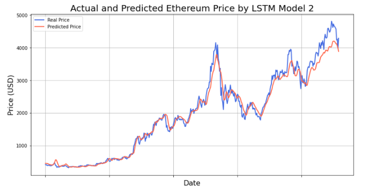

## Ethereum Price Prediction based on data on the blockchain
### My final project at Lighthouse Labs - Data Science Bootcamp

### 1. Project Overview

Cryptocurrency has boomed in popularity over the past few years. Bitcoin was the first and remains the best-known cryptocurrency, while Ethereum is now the most adopted token and the fastest growing among hundreds of blockchains. Ethereum may overtake Bitcoin as the most valuable cryptocurrency sometime in the future. 

Predicting the price of a cryptocurrency is very difficult because, in general, the price is determined by numerous variables that change over time. A multivariate time series model takes several factors into account. This project will build multivariate time series models to predict Ethereum price based on data on the blockchain (on-chain data) by using Recurrent Neural Network Long Short Term Memory (LSTM) and comparing it with traditional machine learning algorithms. Models to predict the price trend also will be presented in this project.

### 2. Dataset

The on-chain data could be downloaded from https://coinmetrics.io/. 
Even though there are hundreds of columns on the Ethereum on-chain data, some data features have more impact on the price based on their mean of information. Their definitions are as follows:
- PriceUSD: Ethereum Price
- AdrActCnt: Number of active addresses
- AdrBal1in100MCnt: Number of addresses with balances greater than 100M 
- AdrBal1in10BCnt: Number of addresses with balances greater than 10B 
- AdrBal1in10MCnt: Number of addresses with balances greater than 10M 
- AdrBal1in1BCnt: Number of addresses with balances greater than 1B
- AdrBal1in1MCnt: Number of addresses with balances greater than 1M
- CapMrktCurUSD: Capitalization Market
- DiffLast: Last difficulty
- DiffMean: Mean difficulty
- FeeMedUSD: Median transaction fees
- FeeTotUSD: Total Fees
- FlowInExUSD: Exchanges In-flow
- FlowOutExUSD: Exchanges Out-flow
- GasUsedTx: Gas used per transaction
- GasUsedTxMean: Mean gas used per transaction
- HashRate: Network hashrate (computing power)
- RevHashNtv: Revenue per hash unit
- RevHashRateUSD: Daily revenue per hash unit per second, USD
- SplyAdrBalUSD1M: Supply in addresses with balances greater than $1M
- TxCnt: Number of transactions
- TxTfrValMedUSD: Median transactions transfer value

### 3. Model Evaluation
#### 3.1 Deep Learning approach
I developed two multivariate recurrent neural networks for time series prediction using Long Short-Term Memory (LSTM). The first model has two LSTM layers, which take our mini-batches as input and return 168 values. Next is a dense layer with 50 neurons and the final dense layer that outputs the predicted value. Model 2 is like Model 1 but includes three LSTM layers, followed by the Dropout function after each LSTM layer to reduce overfitting. In the model evaluation, I found that Model 1 performs better than Model 2.

Model 1 evaluation:
  - R2 Score:  0.974
  - Mean Absolute Error:  136.216
  - Mean Squared Error:  41526.171
  - Mean Absolute Percentage Error: 6.69 %

 
Model 2 evaluation: 
- R2 Score:  0.78
- Mean Absolute Error:  289.18
- Mean Squared Error:  136397.69
- Mean Absolute Percentage Error: 8.57 %

#### 3.2 Predict Ether price using traditional machine learning algorithms
To use regular ML models to predict the price, I reframed the multivariate time-series data into a supervised learning problem, then train data on difference machine learning models.

I also have a good ElasticNet Regression model in predicting the Ethereum price:
  - R2 score is 0.97
  - Mean Absolute Error: 142.19
  - Mean Squared Error: 45553.12
  - Mean Absolute Percentage Error: 7.56 %

  

### 4. Conclustion:
- Both LSTM and Elastic Net Regression models give good results in testing data
- Can choose any time steps and any crytocurrency we want to predict as long as we can get the full on-chain dataset.
- Challenges
  - Sentiment data from social media.
  - Market Manipulation
 
### 5. Next Steps
- Develop multi-steps multivariate models.
