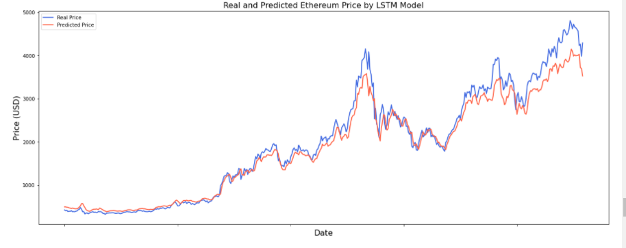
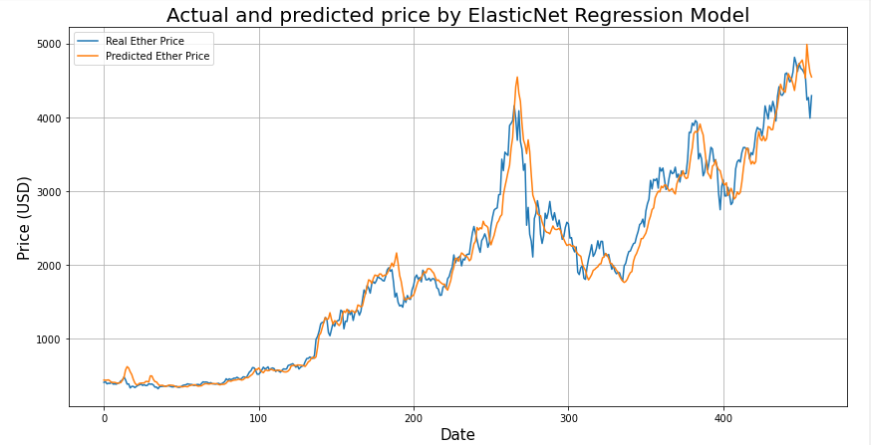

## Ethereum Price Prediction based on blockchain information
### My final project at Lighthouse Labs - Data Science Bootcamp

### 1. Project Overview

Cryptocurrency has boomed in popularity over the past few years. While Bitcoin was the first and remains the best-known cryptocurrency, Ethereum may overtake Bitcoin as the most valuable cryptocurrency sometime in the future. 

Predicting the price of a cryptocurrency is very difficult because, in general, the price is determined by numerous variables that change over time. A multivariate time series model takes several factors into account. In this project, I'll build multivariate time series models to predict Ethereum price based on blockchain information by using Recurrent Neural Network LSTM and comparing it with traditional ML algorithms. I also try to build models to predict whether the price is going up or down.
.
### 2. Dataset

The full on-chain data of is downloaded from https://coinmetrics.io/. There are hundreds of columns on the Ethereum on-chain data, I select the most below important features that have a huge impact on the Ether price. Their definitions are as follows:
- PriceUSD: Ethereum Price
- AdrActCnt: Number of active addresses
- AdrBal1in100MCnt: Number of addresses with balances greater than 100M 
- AdrBal1in10BCnt: Number of addresses with balances greater than 10B 
- AdrBal1in10MCnt: Number of addresses with balances greater than 10M 
- AdrBal1in1BCnt: Number of addresses with balances greater than 1B
- AdrBal1in1MCnt: Number of addresses with balances greater than 1M
- CapMrktCurUSD: Capitalization Market
- DiffLast: Last difficulty
- DiffMean: Mean difficulty
- FeeMedUSD: Median transaction fees
- FeeTotUSD: Total Fees
- FlowInExUSD: Exchanges In-flow
- FlowOutExUSD: Exchanges Out-flow
- GasUsedTx: Gas used per transaction
- GasUsedTxMean: Mean gas used per transaction
- HashRate: Network hashrate (computing power)
- RevHashNtv: Revenue per hash unit
- RevHashRateUSD: Daily revenue per hash unit per second, USD
- SplyAdrBalUSD1M: Supply in addresses with balances greater than $1M
- TxCnt: Number of transactions
- TxTfrValMedUSD: Median transactions transfer value

### 3. Evaluation
- We have a very good result with the LSTM model in Ethereum price prediction
  - R2 Score:  0.974
  - Mean Absolute Error:  136.216
  - Mean Squared Error:  41526.171
  - Mean Absolute Percentage Error: 6.69 %
 
 
 
- We also have a good ElasticNet Regression model in predicting the Ethereum price:
  - R2 score is 0.97
  - Mean Absolute Error: 142.19
  - Mean Squared Error: 45553.12
  - Mean Absolute Percentage Error: 7.56 %

  

### 4. Conclustion:
- Both LSTM and Elastic Net Regression models give good results in testing data
- Can choose any time steps and any crytocurrency we want to predict as long as we can get the full on-chain dataset.
- Challenges
  - Sentiment data from social media.
  - Manipulation
 
### 5. Next Steps
- Develop multi-steps multivariate models.
