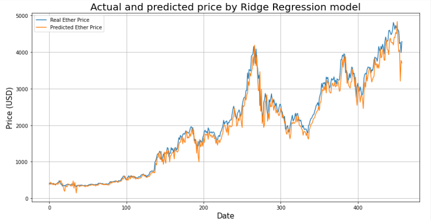

# Ethereum Price Prediction based on blockchain information
### Capstone Project at Lighthouse Labs - Data Science

### 1. Project Overview

### 2. Dataset

### 3. Evaluation
- We have a very good result with the LSTM model in Ethereum price prediction
  - R2 Score:  0.97
  - Mean Absolute Error:  146.03
  - Mean Squared Error:  43666.10
 
 
 
- We also have top 3 best regular machine learning models in predicting the Ethereum price:
  - Lasso Regression with the accuracy is 0.98
    - Mean Absolute Error: 86.27
    - Mean Squared Error: 17201.57
    - Mean Absolute Percentage Error (MDAPE): 4.24 %
    
  
  
  - Ridge Regression with the accuracy is 0.97
    - Mean Absolute Error: 146.38
    - Mean Squared Error: 43899.57
    - Mean Absolute Percentage Error (MDAPE): 4.24 %

  
  
  - Linear Regression with the accuracy is 0.95
    - Mean Absolute Error: 196.17
    - Mean Squared Error: 74505.19
    - Mean Absolute Percentage Error (MDAPE): 4.24 %

  
  
### 4. Next Steps
