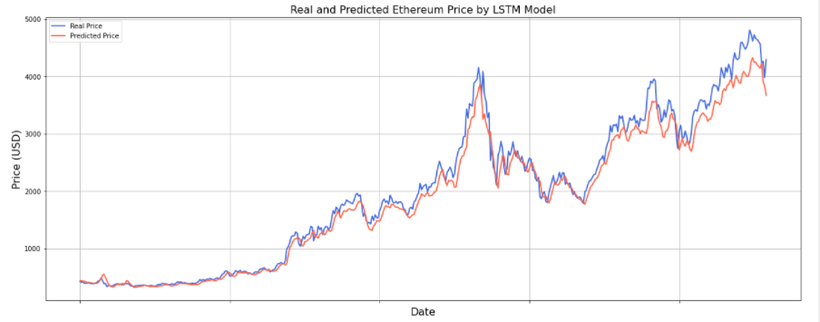

# Ethereum Price Prediction based on blockchain information
### Capstone Project at Lighthouse Labs - Data Science

### 1. Project Overview

### 2. Dataset

### 3. Evaluation
- We have a very good result with the LSTM model in Ethereum price prediction
  - R2 Score:  0.974
  - Mean Absolute Error:  136.216
  - Mean Squared Error:  41526.171
  - Mean Absolute Percentage Error: 6.69 %
 
 
 
- We also have the best classic machine learning models in predicting the Ethereum price:

  - ElasticNet Regression with R2 score is 0.97
    - Mean Absolute Error: 142.19
    - Mean Squared Error: 45553.12
    - Mean Absolute Percentage Error: 7.56 %

  

  - Linear Regression with R2 score is 0.95
    - Mean Absolute Error: 196.17
    - Mean Squared Error: 74505.19
    - Mean Absolute Percentage Error: 9.55 %

  
  
### 4. Next Steps
